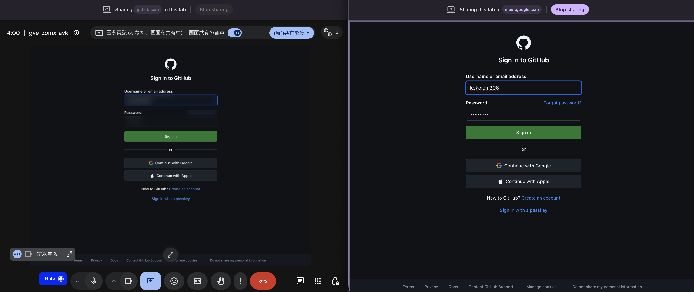
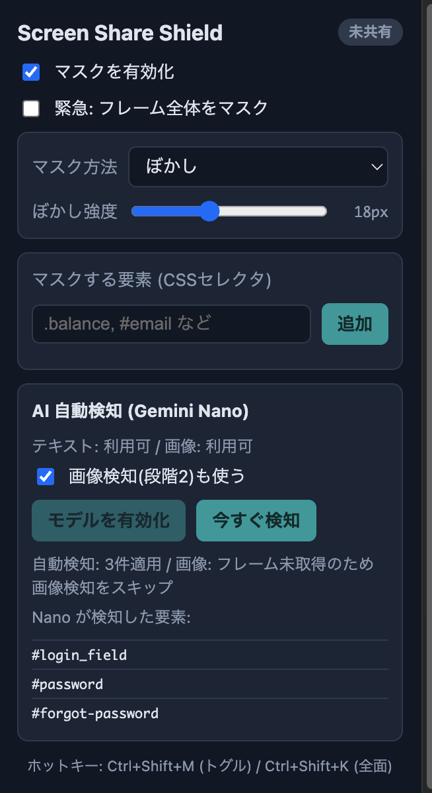

# Screen Share Shield

[English](./README.md) · **日本語**

画面共有中だけ、**相手に届く映像**に映る機密情報をマスクする Chrome 拡張。
自分が作業している本物の画面はそのまま、共有される映像だけを加工します。

AI 検知は**オンデバイス**（Gemini Nano）で動き、サーバーには何も送りません。

## デモ

GitHub ログイン画面を共有: 共有される映像（左）ではユーザー名とパスワードがマスクされ、
自分のタブ（右）はそのまま読めます。

popup — オンデバイス AI がログイン欄（`#login_field`, `#password`）を検知。

## できること

タブを共有すると、送出映像を1フレームずつ加工して機密箇所をぼかし（または黒塗り）します。
相手の映像と、会議アプリ内の自分のセルフプレビューはマスクされますが、あなたが作業している本物のタブはそのままです。
隠す対象は手動で指定するか、オンデバイス AI に見つけさせられます。

## 機能

- 共有される映像だけをマスク（自分の画面は影響を受けない）。
- オンデバイス AI 検知（Gemini Nano）が機密フィールド（カード番号・メール・残高・ID 等）を見つけてマスク。
  ページが変わると自動で再検知（遷移・新しい入力欄など）。
- 手動マスク: 任意の要素を CSS セレクタで指定。
- クロスタブ: Meet/Zoom で別タブを共有したときも要素マスクが効く。
- 緊急の全面マスク: ホットキー1つで画面全体を即ぼかし。
- ホットキー: マスク切替（`Ctrl+Shift+M`）、全面マスク（`Ctrl+Shift+K`）。
- ぼかし / 黒塗りを選択、ぼかし強度も調整可。

## 必要環境

- 最近の Chrome。
- AI 検知を使うには Gemini Nano（Prompt API）が利用できる Chrome/端末。
  手動マスク・クロスタブマスク・全面マスクは Nano なしでも動作します。

## 導入

開発版（unpacked）として読み込みます:

1. `pnpm install && pnpm build`
2. `chrome://extensions/` を開き「デベロッパーモード」を ON
3. 「パッケージ化されていない拡張機能を読み込む」→ `.output/chrome-mv3` を選択

## 使い方

1. 守りたいページを開き、会議アプリで **「Chrome タブ」** を選んで共有を開始。
2. Screen Share Shield アイコンをクリックして、隠す対象を指定:
   - 手動 — CSS セレクタ（例 `.balance`, `#email`）を入力して「追加」。
   - 自動 — 「今すぐ検知」を押すと、オンデバイス AI が見つけた機密要素を一覧表示してマスク。
3. 共有される映像でその箇所が隠れ、自分の画面は読めるままになります。
4. 今すぐ全部隠したいときは `Ctrl+Shift+K`。

別タブを共有する場合（例: Meet でタブをプレゼン）は、**機密が載っているタブ**で「今すぐ検知」を実行してください。
マスクがそのまま共有に反映されます。

## 制約

- 要素単位マスクは **タブ共有** のときに効きます。ウィンドウ/画面全体の共有では緊急の全面マスクのみ。
- AI 検知には Gemini Nano が利用可能な Chrome が必要です。
- 機密タブを複数同時に開いていると、クロスタブのマスクは安全側に倒れて過剰マスクになることがあります。
- ページが変わった直後は AI 再検知が終わるまで数秒の空白があります。確実に隠したい瞬間は手動「今すぐ検知」か全面マスクを使ってください。

## 開発者向け

アーキテクチャ・メッセージ契約・ビルド/テストコマンド・設計トレードオフは **[CLAUDE.md](./CLAUDE.md)** にあります。
